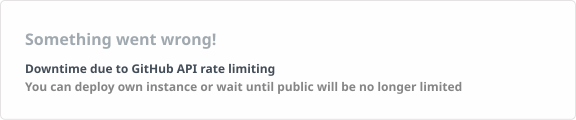

# Leslie Wong

> An incubating proficient software engineer (Web & Mobile & ML). Predilection for JavaScript, Python, and Open Source.

---

Workflow:

  

 

etc.

 

Having developed a significant number of indie applications using JavaScript or TypeScript spanning a variety of disciplines, covering

**Applied mathematics:**

🧩[*Playgameoflife.github.io (Website)*](https://playgameoflife.github.io), with online talks presented at the 1st & 3rd JSXGraph Conference (Germany).

🎲[*JSBI-Calculator (NPM Library)*](https://www.npmjs.com/package/jsbi-calculator), based on GoogleChromeLabs' JSBI.

**Digital Media Arts:**

🧑‍🎨[*Boost Art Net (Website)*](https://boost-art.net), one of the winners of UNESCO TechCul Entrepreneur Prizes.

🎨*Western Aesthetics*, a wechat mini program

**Image Processing:**

🖼️[*BoostPic (Chrome Extension)*](https://chrome.google.com/webstore/detail/boostpic-search-google-im/pmpogggmiaehmjempogkkklfckignfgl), Google Lens related.

**Multimedia Information Retrieval:**

⚡[*Shotit: compute-efficient image-to-video search engine for the cloud*](https://shotit.github.io/), [arXiv:2404.12169 (2024)](https://arxiv.org/abs/2404.12169), with which you can incubate a domain-specific screenshot-to-video search engine for entertainment or productivity purposes. For example, TV/Film clip retrival and editing, surgery video retrival and analysis, etc.

And also experienced with Python(Web & ML). [_Coursera Deep Learning Specialization_](https://www.coursera.org/account/accomplishments/specialization/certificate/8LSKNGX4MUQ3) certificated.

**Keep growing!**

---

 

---

## Get in touch

---
